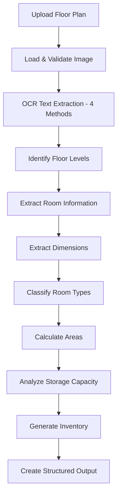

# Floor Plan Analysis & Data Extraction Guide

## 📋 Overview

The Enhanced Floor Plan Analyzer uses advanced OCR (Optical Character Recognition) and computer vision techniques to extract detailed information from architectural floor plan images. This document outlines what data is extracted, requirements for optimal results, and the complete field structure.

---

## 🎯 What We Extract

### 1. **Room Information**
- **Room Names**: Exact text as it appears on the floor plan
- **Room Types**: Classified categories (bedroom, kitchen, bathroom, etc.)
- **Room Dimensions**: Width × Length measurements in meters
- **Room Areas**: Calculated square meter areas
- **Floor Levels**: Ground Floor, First Floor, Second Floor, etc.

### 2. **Property Structure**
- **Multi-floor layouts**: Automatic floor detection and grouping
- **Room relationships**: Spatial positioning and adjacency
- **Total property metrics**: Overall area, room counts, floor counts

### 3. **Storage Analysis**
- **Storage spaces**: Garages, storage rooms, under-house storage
- **Storage capacity**: Total area available for storage
- **Storage suitability**: Assessment for different item types

### 4. **Moving Inventory**
- **Room-specific items**: Furniture and belongings by room type
- **Packing estimates**: Number of boxes needed per room
- **Heavy items**: Items requiring special moving equipment

---

## 📐 Required Floor Plan Elements

### **Essential Text Elements**
For optimal extraction, floor plans should contain:

#### Room Labels
```
✅ GOOD EXAMPLES:
- "LIVING"
- "BED 2" 
- "MASTER BED"
- "KITCHEN"
- "BATH"
- "GARAGE"
- "DINING"

❌ AVOID:
- Unlabeled rooms
- Symbols only (no text)
- Handwritten labels
```

#### Dimensions
```
✅ SUPPORTED FORMATS:
- "4.8 x 5.2m"
- "4.8 × 5.2m" 
- "4.8m x 5.2m"
- "4.8 by 5.2"
- "3.6 x 4.0"

❌ NOT SUPPORTED:
- Imperial measurements (feet/inches)
- Dimensions without clear association to rooms
- Partial dimensions
```

#### Floor Indicators
```
✅ RECOGNIZED:
- "GROUND FLOOR"
- "FIRST FLOOR" 
- "SECOND FLOOR"
- "BASEMENT"
- "LEVEL 1", "LEVEL 2"

❌ NOT RECOGNIZED:
- Floor indicators in legends only
- Implied floor levels without text
```

---

## 🏠 Room Type Classification

### **Supported Room Types**

| **Category** | **Detected Types** | **Keywords Recognized** |
|--------------|-------------------|------------------------|
| **Bedrooms** | `bedroom` | bed, bedroom, master, br, sleep |
| **Living Areas** | `living_room` | living, lounge, family, formal, sitting |
| **Dining** | `dining_room` | dining, meals, eat |
| **Kitchen** | `kitchen` | kitchen, cook, pantry |
| **Bathrooms** | `bathroom` | bath, bathroom, wc, toilet, powder room |
| **Laundry** | `laundry` | laundry, ldry, wash |
| **Storage** | `garage`, `storage` | garage, storage, store, under house |
| **Work Areas** | `office` | office, study, work, media |
| **Entry/Circulation** | `entry`, `hallway` | entry, foyer, hall, corridor |
| **Outdoor** | `balcony`, `deck`, `porch` | balcony, deck, porch, patio |
| **Other** | `closet`, `linen` | closet, robe, linen, ln |

---

## 📊 Complete Data Structure

### **Main Response Object**
```json
{
  "success": boolean,
  "property_info": {
    "total_rooms": number,
    "total_area_sqm": number,
    "num_floors": number
  },
  "floors": [FloorObject],
  "storage_analysis": StorageAnalysis,
  "inventory_summary": InventorySummary,
  "debug_info": DebugInfo
}
```

### **Floor Object**
```json
{
  "name": string,              // "Ground Floor", "First Floor"
  "room_count": number,        // Number of rooms on this floor
  "total_area_sqm": number,    // Total floor area
  "rooms": [RoomObject]        // Array of room objects
}
```

### **Room Object**
```json
{
  "name": string,              // "Living Room", "Bed 2", "Master Bedroom"
  "type": string,              // "bedroom", "kitchen", "bathroom", etc.
  "area_sqm": number,          // Room area in square meters
  "dimensions": string,        // "4.8 x 5.2m" or "Estimated"
  "is_storage": boolean,       // Whether room is suitable for storage
  "inventory": {
    "regular_items": [string], // ["Sofa", "Coffee table", "TV"]
    "boxes": [string],         // ["Books box", "Electronics box"]
    "heavy_items": [string]    // ["Piano", "Large TV"]
  }
}
```

### **Storage Analysis**
```json
{
  "total_storage_area_sqm": number,     // Total storage space
  "total_storage_area_sqft": number,    // Total storage in square feet
  "num_storage_spaces": number,         // Count of storage rooms
  "storage_spaces": [
    {
      "name": string,                   // "Double Garage"
      "area_sqm": number,               // 30.8
      "floor": string                   // "Ground Floor"
    }
  ],
  "garage_spaces": number,              // Number of garage spaces
  "dedicated_storage_spaces": number,   // Non-garage storage spaces
  "suitable_for_heavy_items": boolean,  // Can accommodate heavy items
  "suitable_for_boxes": boolean         // Can accommodate boxes
}
```

### **Inventory Summary**
```json
{
  "total_rooms": number,                // Total rooms detected
  "total_boxes_estimated": number,      // Estimated boxes needed
  "total_heavy_items_estimated": number, // Heavy items requiring special handling
  "rooms_by_type": {
    "bedroom": number,                  // Count by room type
    "living_room": number,
    "kitchen": number,
    "bathroom": number,
    // ... etc
  }
}
```

---

## 🖼️ Image Requirements

### **Optimal Image Characteristics**

#### **Format & Quality**
- **Supported formats**: JPG, JPEG, PNG, GIF, BMP
- **Recommended resolution**: 1920×1080 or higher
- **File size**: Under 10MB
- **DPI**: 150 DPI or higher for text clarity

#### **Image Content**
- **Professional floor plans**: Architectural drawings work best
- **Clear text**: Room labels should be legible
- **High contrast**: Dark text on light background
- **Minimal compression**: Avoid heavily compressed images

#### **Text Requirements**
- **Font size**: Text should be at least 12pt equivalent
- **Text clarity**: Sharp, not blurry or pixelated
- **Language**: English text only
- **Orientation**: Upright text (not rotated)

### **Image Quality Examples**

```
✅ EXCELLENT:
- Professional architectural drawings
- CAD-generated floor plans
- High-resolution scanned blueprints
- Real estate marketing floor plans

✅ GOOD:
- Hand-drawn plans with clear text
- Photographed floor plans (well-lit, straight)
- PDF exports converted to images

⚠️ MARGINAL:
- Low-resolution images
- Compressed/pixelated text
- Handwritten labels
- Rotated or skewed images

❌ POOR:
- Blurry photographs
- Heavily compressed images
- Plans without text labels
- Non-English text
```

---

## 🔧 OCR Processing Methods

The system uses 4 different OCR processing methods:

### **Method 1: Original Image**
- **Purpose**: Direct text extraction
- **Parameters**: Aggressive settings for small architectural text
- **Best for**: High-quality, clear images

### **Method 2: Enhanced Contrast**
- **Purpose**: Improve faint or low-contrast text
- **Technique**: CLAHE (Contrast Limited Adaptive Histogram Equalization)
- **Best for**: Scanned documents, faded plans

### **Method 3: Adaptive Threshold**
- **Purpose**: Handle line drawings and blueprints
- **Technique**: Gaussian adaptive thresholding
- **Best for**: CAD drawings, technical blueprints

### **Method 4: Morphological Processing**
- **Purpose**: Clean up noise and connect broken text
- **Technique**: Opening and closing operations
- **Best for**: Noisy or degraded images

---

## 📋 Extraction Process Flow



---

## 🎯 Expected Extraction Results

### **For a Typical 2-Story House:**

```json
{
  "success": true,
  "property_info": {
    "total_rooms": 15,
    "total_area_sqm": 245.67,
    "num_floors": 2
  },
  "floors": [
    {
      "name": "Ground Floor",
      "room_count": 8,
      "total_area_sqm": 156.32,
      "rooms": [
        {
          "name": "Double Garage",
          "type": "garage",
          "area_sqm": 30.8,
          "dimensions": "5.6 x 5.5m",
          "is_storage": true
        },
        {
          "name": "Living/Dining", 
          "type": "living_room",
          "area_sqm": 63.64,
          "dimensions": "8.6 x 7.4m",
          "is_storage": false
        }
        // ... more rooms
      ]
    },
    {
      "name": "First Floor",
      "room_count": 7,
      "rooms": [
        {
          "name": "Master Bedroom",
          "type": "bedroom", 
          "area_sqm": 16.2,
          "dimensions": "3.6 x 4.5m"
        }
        // ... more rooms
      ]
    }
  ],
  "storage_analysis": {
    "total_storage_area_sqm": 154.32,
    "num_storage_spaces": 3,
    "suitable_for_heavy_items": true
  },
  "inventory_summary": {
    "total_rooms": 15,
    "total_boxes_estimated": 42,
    "total_heavy_items_estimated": 18,
    "rooms_by_type": {
      "bedroom": 5,
      "living_room": 2,
      "kitchen": 1,
      "bathroom": 3,
      "garage": 1,
      "office": 1,
      "laundry": 1,
      "storage": 1
    }
  }
}
```

---

## 🚨 Error Handling

### **When OCR Fails**
If the system cannot extract room information, it returns:

```json
{
  "success": false,
  "error": "OCR failed to extract room information from floor plan",
  "debug_info": {
    "ocr_available": boolean,
    "ocr_reader_initialized": boolean,
    "text_elements_found": number,
    "image_shape": [height, width, channels],
    "message": "Detailed error explanation"
  }
}
```

### **Common Failure Reasons**
1. **EasyOCR not installed**: Missing OCR library
2. **Poor image quality**: Text too small, blurry, or low contrast
3. **No text labels**: Floor plan contains only symbols/graphics
4. **Unsupported language**: Non-English text
5. **Image format issues**: Corrupted or unsupported file format

---

## 🛠️ Troubleshooting & Testing

### **Debug Tools Available**

#### **OCR Test Script**
```bash
# Test OCR installation and functionality
python test_ocr_debug.py

# Test with specific image
python test_ocr_debug.py path/to/floor_plan.jpg
```

#### **Debug Output**
- **OCR status**: Whether OCR is working
- **Text detection results**: What text was found
- **Debug images**: Visual representation of detected text
- **Confidence scores**: Reliability of text detection

### **Optimization Tips**

1. **Image Preprocessing**:
   - Increase contrast if text is faint
   - Ensure image is properly oriented
   - Remove unnecessary elements/noise

2. **Text Enhancement**:
   - Ensure room labels are clearly visible
   - Use standard architectural terminology
   - Include dimension text near room labels

3. **File Optimization**:
   - Use uncompressed or lightly compressed formats
   - Maintain high resolution for text clarity
   - Ensure file size is under 10MB limit

---

## 📞 API Integration

### **Endpoint**
```
POST /api/inventory/analyze-floor-plan/
Content-Type: multipart/form-data
Field: floor_plan (image file)
```

### **Response Format**
The API returns the complete data structure as documented above, enabling integration with:
- Moving cost calculators
- Inventory management systems
- Property analysis tools
- Real estate applications

---

## 🔄 Version History

- **v2.0**: Enhanced OCR with 4 processing methods
- **v1.5**: Added dimension extraction and storage analysis
- **v1.0**: Basic room detection and classification

---

*This document covers all aspects of floor plan data extraction. For technical implementation details, see the source code in `floor_plan_analyzer.py`.*
